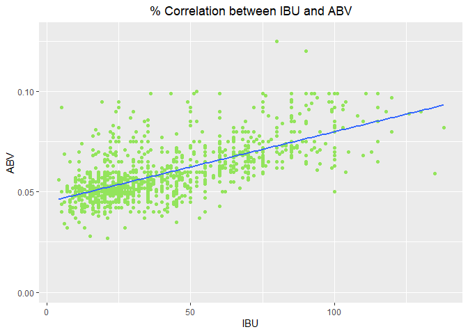

## Introduction

The data provided for this analysis consists of 2410 US craft beers from 558 US breweries. Our data analysis that follows highlights the following:

* A look at the data
* How many breweries are in each state
* Missing values for ABV & IBU measurements
* Descriptive information for ABV
* Median ABV & IBU by state
* Beer with the highest ABV and beer with the highest IBU
* Correlation between ABV and IBU

## Setup: Libraries and Reading in Datasets

```r
library(RCurl)
library(plyr)
library(ggplot2)
library(dplyr)
library(tidyverse)
library(car)
library(naniar)
library(viridis)
library(scales)

setwd("./Data")

Beers <- read.csv(file="Beers.csv")
Breweries <- read.csv(file="Breweries.csv")

opts <- options()
options(ggplot2.continuous.colour="viridis")
options(ggplot2.continuous.fill="viridis")
```

## A Look at the Data

```r
BreweriesFullDataset <- merge(Breweries,Beers, by.x = "Brew_ID", by.y = "Brewery_id",all=TRUE)
names(BreweriesFullDataset) <- c("Brew_ID","Brewery","City","State","Beer","Beer_ID","ABV","IBU","Style","Ounces")
head(BreweriesFullDataset,6)
```

```
##   Brew_ID            Brewery        City State          Beer Beer_ID   ABV
## 1       1 NorthGate Brewing  Minneapolis    MN       Pumpion    2689 0.060
## 2       1 NorthGate Brewing  Minneapolis    MN    Stronghold    2688 0.060
## 3       1 NorthGate Brewing  Minneapolis    MN   Parapet ESB    2687 0.056
## 4       1 NorthGate Brewing  Minneapolis    MN  Get Together    2692 0.045
## 5       1 NorthGate Brewing  Minneapolis    MN Maggie's Leap    2691 0.049
## 6       1 NorthGate Brewing  Minneapolis    MN    Wall's End    2690 0.048
##   IBU                               Style Ounces
## 1  38                         Pumpkin Ale     16
## 2  25                     American Porter     16
## 3  47 Extra Special / Strong Bitter (ESB)     16
## 4  50                        American IPA     16
## 5  26                  Milk / Sweet Stout     16
## 6  19                   English Brown Ale     16
```

```r
tail(BreweriesFullDataset,6)
```

```
##      Brew_ID                       Brewery          City State
## 2405     556         Ukiah Brewing Company         Ukiah    CA
## 2406     557       Butternuts Beer and Ale Garrattsville    NY
## 2407     557       Butternuts Beer and Ale Garrattsville    NY
## 2408     557       Butternuts Beer and Ale Garrattsville    NY
## 2409     557       Butternuts Beer and Ale Garrattsville    NY
## 2410     558 Sleeping Lady Brewing Company     Anchorage    AK
##                           Beer Beer_ID   ABV IBU                   Style
## 2405             Pilsner Ukiah      98 0.055  NA         German Pilsener
## 2406         Porkslap Pale Ale      49 0.043  NA American Pale Ale (APA)
## 2407           Snapperhead IPA      51 0.068  NA            American IPA
## 2408         Moo Thunder Stout      50 0.049  NA      Milk / Sweet Stout
## 2409  Heinnieweisse Weissebier      52 0.049  NA              Hefeweizen
## 2410 Urban Wilderness Pale Ale      30 0.049  NA        English Pale Ale
##      Ounces
## 2405     12
## 2406     12
## 2407     12
## 2408     12
## 2409     12
## 2410     12
```

## Brewery Counts by State

```r
BreweriesByState <- plyr::count(Breweries$State)

ggplot(BreweriesByState,aes(x=reorder(x,-freq),y=freq,fill=freq)) +
  geom_bar(stat="identity",position="dodge",show.legend=FALSE) +
  xlab("State") +
  ylab("Brewery Count") +
  ggtitle("Brewery Counts by State") +
  theme(plot.title = element_text(hjust = 0.5)) +
  theme(axis.text.x = element_text(angle = 90, hjust = 0, vjust=0.5))
```

<!-- -->

## Missing Values

```r
gg_miss_var(BreweriesFullDataset) +
  ggtitle("Missing Values by Variable") + 
  theme(plot.title = element_text(hjust = 0.5))
```

<!-- -->

```r
gg_miss_fct(x=select(BreweriesFullDataset,State,ABV,IBU),fct=State) +
  theme(plot.title = element_text(hjust = 0.5)) +
  theme(axis.text.x = element_text(angle = 90, hjust = 0, vjust=0.5)) +
  ggtitle("% Missing ABV & IBU Values by State")
```

<!-- -->

## Summary Statistics for ABV

```r
summary(BreweriesFullDataset$ABV)
```

```
##    Min. 1st Qu.  Median    Mean 3rd Qu.    Max.    NA's 
## 0.00100 0.05000 0.05600 0.05977 0.06700 0.12800      62
```

## Median ABV & IBU by State

```r
Median.ABV.IBU <- BreweriesFullDataset %>% group_by(State)%>% summarise(Median_ABV=median(ABV,na.rm=TRUE),Median_IBU=median(IBU,na.rm=TRUE))

ggplot(Median.ABV.IBU,aes(x=reorder(State,-Median_ABV),y=Median_ABV,fill=Median_ABV)) +
  geom_bar(stat="identity",position="dodge",show.legend=FALSE) + xlab("State") + ylab("ABV") +
  ggtitle("Median ABV by State") +
  theme(plot.title = element_text(hjust = 0.5)) +
  theme(axis.text.x = element_text(angle = 90, hjust = 0, vjust=0.5))
```

<!-- -->

```r
ggplot(Median.ABV.IBU,aes(x=reorder(State,-Median_IBU),y=Median_IBU,fill=Median_IBU)) +
  geom_bar(stat="identity",position="dodge",show.legend=FALSE) +
  xlab("State") + ylab("Median IBU by State") +
  ggtitle("IBU by State") +
  theme(plot.title = element_text(hjust = 0.5)) +
  theme(axis.text.x = element_text(angle = 90, hjust = 0, vjust=0.5))
```

```
## Warning: Removed 1 rows containing missing values (geom_bar).
```

<!-- -->

## Max ABV & IBU

```r
BreweriesFullDataset[which.max(BreweriesFullDataset$ABV),]
```

```
##     Brew_ID                 Brewery    City State
## 384      52 Upslope Brewing Company Boulder    CO
##                                                     Beer Beer_ID   ABV IBU
## 384 Lee Hill Series Vol. 5 - Belgian Style Quadrupel Ale    2565 0.128  NA
##                Style Ounces
## 384 Quadrupel (Quad)   19.2
```

```r
BreweriesFullDataset[which.max(BreweriesFullDataset$IBU),]
```

```
##      Brew_ID                 Brewery    City State
## 1857     375 Astoria Brewing Company Astoria    OR
##                           Beer Beer_ID   ABV IBU
## 1857 Bitter Bitch Imperial IPA     980 0.082 138
##                               Style Ounces
## 1857 American Double / Imperial IPA     12
```

## Relationship between ABV & IBU

```r
scatterplot(BreweriesFullDataset$ABV,BreweriesFullDataset$IBU,xlab="ABV",ylab="IBU",main="Relationship between ABV and IBU",smooth = FALSE, grid = FALSE, frame = FALSE, col="#35B779FF")
```

<!-- -->

```r
cor(BreweriesFullDataset$IBU,BreweriesFullDataset$ABV,method=c("pearson","kendall","spearman"),use="complete.obs")
```

```
## [1] 0.6706215
```

```r
lm <- lm(IBU~ABV,data=BreweriesFullDataset)
summary(lm)$r.squared
```

```
## [1] 0.4497332
```
