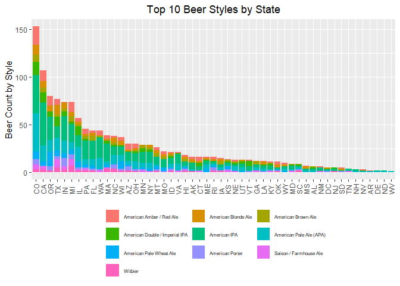
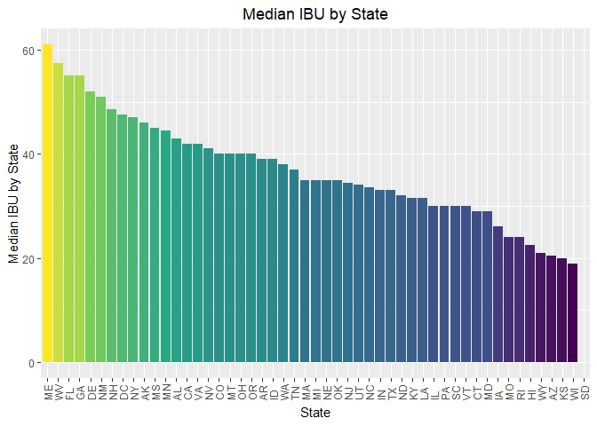

## Introduction

Using the Beer and Breweries data files provided by Budweiser, our team was able to extrapolate information that could be beneficial in entering the craft beer market for Budweiser.  The elements we focused on were breweries by State, beer styles, Alcohol by Volume (ABV), and International Bitterness Unit (IBU).

The data provided for this analysis consists of 2410 US craft beers from 558 US breweries. The data analysis that follows highlights the following in order to describe the current craft beer market:

* A look at the data
* Missing values for ABV & IBU measurements
* How many breweries are in each state
* Descriptive information for ABV
* Median ABV & IBU by state
* Beer with the highest ABV and beer with the highest IBU
* Correlation between ABV and IBU

The purpose is to give you descriptive information about the current craft beer market in the US to help direct what type of craft beer to produce and where to market it.

## Setup: Libraries and Reading in Datasets

```r
library(RCurl)
library(plyr)
library(ggplot2)
library(dplyr)
library(tidyverse)
library(car)
library(naniar)
library(viridis)
library(scales)

setwd("./Data")

Beers <- read.csv(file="Beers.csv")
Breweries <- read.csv(file="Breweries.csv")

opts <- options()
options(ggplot2.continuous.colour="viridis")
options(ggplot2.continuous.fill="viridis")
```

## A Look at the Data

To get a sense of the data, we have proivded the first 6 and last 6 records of the data. Reviewing the data shows that one brewery can have multiple beers that it produces and that not all values are populated for every observation. Some information about these records is provided below:

All states (including D.C.) have at least one brewery and 33 states (including D.C.) have 10 or fewer breweries.


The first six observations (sorted by by brewery ID):

* Northgate in MN is the only brewery
* The beer size for all is 16oz
* The ABV range is .045-.060
* The IBU range is 19-50
* 6 different beer styles


```r
BreweriesFullDataset <- merge(Breweries,Beers, by.x = "Brew_ID", by.y = "Brewery_id",all=TRUE)
names(BreweriesFullDataset) <- c("Brew_ID","Brewery","City","State","Beer","Beer_ID","ABV","IBU","Style","Ounces")
head(BreweriesFullDataset,6)
```

```
##   Brew_ID            Brewery        City State          Beer Beer_ID   ABV
## 1       1 NorthGate Brewing  Minneapolis    MN       Pumpion    2689 0.060
## 2       1 NorthGate Brewing  Minneapolis    MN    Stronghold    2688 0.060
## 3       1 NorthGate Brewing  Minneapolis    MN   Parapet ESB    2687 0.056
## 4       1 NorthGate Brewing  Minneapolis    MN  Get Together    2692 0.045
## 5       1 NorthGate Brewing  Minneapolis    MN Maggie's Leap    2691 0.049
## 6       1 NorthGate Brewing  Minneapolis    MN    Wall's End    2690 0.048
##   IBU                               Style Ounces
## 1  38                         Pumpkin Ale     16
## 2  25                     American Porter     16
## 3  47 Extra Special / Strong Bitter (ESB)     16
## 4  50                        American IPA     16
## 5  26                  Milk / Sweet Stout     16
## 6  19                   English Brown Ale     16
```

The last six observations (sorted by by brewery ID):

* 3 different breweries comprise the last 6 observations
* The beer size is 12oz
* The ABV range is .043-.068
* The IBU is not provided
* 6 different beer styles
* Butternuts Beer & Ale in KY is 4 of the 6 breweries


```r
tail(BreweriesFullDataset,6)
```

```
##      Brew_ID                       Brewery          City State
## 2405     556         Ukiah Brewing Company         Ukiah    CA
## 2406     557       Butternuts Beer and Ale Garrattsville    NY
## 2407     557       Butternuts Beer and Ale Garrattsville    NY
## 2408     557       Butternuts Beer and Ale Garrattsville    NY
## 2409     557       Butternuts Beer and Ale Garrattsville    NY
## 2410     558 Sleeping Lady Brewing Company     Anchorage    AK
##                           Beer Beer_ID   ABV IBU                   Style
## 2405             Pilsner Ukiah      98 0.055  NA         German Pilsener
## 2406         Porkslap Pale Ale      49 0.043  NA American Pale Ale (APA)
## 2407           Snapperhead IPA      51 0.068  NA            American IPA
## 2408         Moo Thunder Stout      50 0.049  NA      Milk / Sweet Stout
## 2409  Heinnieweisse Weissebier      52 0.049  NA              Hefeweizen
## 2410 Urban Wilderness Pale Ale      30 0.049  NA        English Pale Ale
##      Ounces
## 2405     12
## 2406     12
## 2407     12
## 2408     12
## 2409     12
## 2410     12
```


## Missing Values

An analysis of missing values present in the data can help identify patterns. ABV and IBU were the only fields where missing values were found. It is interesting to note that there is a high percentage of missing values for IBU (42%) but not ABV (3%). Also, every instance where ABV was missing, IBU was also missing. 

The graph below shows that only IBU and ABV have missing values.


```r
gg_miss_var(BreweriesFullDataset) +
  ggtitle("Missing Values by Variable") + 
  theme(plot.title = element_text(hjust = 0.5))
```

<!-- -->

The next chart highlights the percentage of missing values for ABV and IBU by state. SD does not have any records where IBU is populated.


```r
gg_miss_fct(x=select(BreweriesFullDataset,State,ABV,IBU),fct=State) +
  theme(plot.title = element_text(hjust = 0.5)) +
  theme(axis.text.x = element_text(angle = 90, hjust = 0, vjust=0.5)) +
  ggtitle("% Missing ABV & IBU Values by State")
```

<!-- -->

For the purpose of this analysis, we omit records when the pertinent field is missing values. FOr example, all records are used in the Brewery Counts by State graph, but 62 records are removed on the Median ABV by State graph because ABV is missing.

## Brewery Counts by State

The following charts shows brewery counts by state. Colorado, California, Michigan, Oregan and Texas are 5 states with the most craft breweries. Nevada, D.C., North Dakota, South Dakota and West Virginia are the 5 locales with the fewest craft breweries.


```r
BreweriesByState <- plyr::count(Breweries$State)

ggplot(BreweriesByState,aes(x=reorder(x,-freq),y=freq,fill=freq)) +
  geom_bar(stat="identity",position="dodge",show.legend=FALSE) +
  xlab("State") +
  ylab("Brewery Count") +
  ggtitle("Brewery Counts by State") +
  theme(plot.title = element_text(hjust = 0.5)) +
  theme(axis.text.x = element_text(angle = 90, hjust = 0, vjust=0.5))
```

<!-- -->

The more saturated a market is the more difficult it may be to enter the market. More research on overall beer consumption compared to craft beer consumption by market is recommended to help identify an ideal place to enter the market.

## Top 10 Beer Styles by State

The top 10 beer styles out of the 100 found in the data provided are as follows (in descending order):

* American IPA
* American Pale Ale (APA)
* American Amber/Red Ale
* American Blonde Ale
* American Double/Imperial IPA
* American Pale Wheat Ale
* American Brown Ale
* American Porter
* Saison/Farmhouse Ale
* Witbier

As far as what types of beer to produce, the graph below shows the production of these top 10 beer styles by state. We are using a measure of popularity based on the number of beers produced, not consumption. This shows popularity of beers in each market.


```r
BeerStyles <- plyr::count(Beers$Style)
str(BeerStyles)
```

```
## 'data.frame':	100 obs. of  2 variables:
##  $ x   : Factor w/ 100 levels "","Abbey Single Ale",..: 1 2 3 4 5 6 7 8 9 10 ...
##  $ freq: int  5 2 13 18 133 29 3 36 108 70 ...
```

```r
TopBeerStyles <- head(arrange(BeerStyles,desc(freq)), n = 10)
TopBeerStylesFullData <- merge(x=BreweriesFullDataset,y=TopBeerStyles,by.x="Style",by.y="x",all.y=TRUE)
ggplot(TopBeerStylesFullData,aes(x=reorder(State,-rep(1,length(State)),sum),fill=Style)) + geom_bar() + theme(axis.title.x = element_blank())  + ylab("Beer Count by Style") + ggtitle("Top 10 Beer Styles by State") + theme(plot.title = element_text(hjust = 0.5)) + theme(axis.text.x = element_text(angle=90,hjust=0,vjust=0.5)) + theme(legend.position="bottom") + theme(legend.text = element_text(size=6)) + guides(fill=guide_legend(nrow=4, byrow=TRUE)) + theme(legend.title = element_blank())
```

<!-- -->

## Summary Statistics for ABV

It is important to know some information about the properties of the beer when entering the craft beer market. What you see here is statistics for ABV. 

```r
summary(BreweriesFullDataset$ABV)
```

```
##    Min. 1st Qu.  Median    Mean 3rd Qu.    Max.    NA's 
## 0.00100 0.05000 0.05600 0.05977 0.06700 0.12800      62
```

```r
ggplot(BreweriesFullDataset,aes(y=ABV)) +
  geom_boxplot(fill="#93e45c") +
  scale_x_discrete(limits=c("0")) +
  ggtitle("ABV Summary Statistics") +
  theme(plot.title = element_text(hjust = 0.5))
```

```
## Warning: Removed 62 rows containing non-finite values (stat_boxplot).
```

<!-- -->

The average ABV is 6%. The middle 50% of the data fall between 5% and 6.7%. You may want to target this range during production. 

We do not include a similar view for IBU because a significant percentage of records are missing data.

## Median ABV & IBU by State

The graph below shows median values for ABV by state. The range for medians is relatively tight, between 4% and 6%.

```r
Median.ABV.IBU <- BreweriesFullDataset %>% group_by(State)%>% summarise(Median_ABV=median(ABV,na.rm=TRUE),Median_IBU=median(IBU,na.rm=TRUE))

ggplot(Median.ABV.IBU,aes(x=reorder(State,-Median_ABV),y=Median_ABV,fill=Median_ABV)) +
  geom_bar(stat="identity",position="dodge",show.legend=FALSE) + xlab("State") + ylab("ABV") +
  ggtitle("Median ABV by State") +
  theme(plot.title = element_text(hjust = 0.5)) +
  theme(axis.text.x = element_text(angle = 90, hjust = 0, vjust=0.5))
```

<!-- -->

The graph below shows median values for IBU by state. The range for medians is more spread, between 20 and just over 60.

```r
ggplot(Median.ABV.IBU,aes(x=reorder(State,-Median_IBU),y=Median_IBU,fill=Median_IBU)) +
  geom_bar(stat="identity",position="dodge",show.legend=FALSE) +
  xlab("State") + ylab("Median IBU by State") +
  ggtitle("Median IBU by State") +
  theme(plot.title = element_text(hjust = 0.5)) +
  theme(axis.text.x = element_text(angle = 90, hjust = 0, vjust=0.5))
```

```
## Warning: Removed 1 rows containing missing values (geom_bar).
```

<!-- -->

## Max ABV & IBU

The beer with the maximum ABV is the 19.2oz "Lee Hill Series Vol.5 - Belgian Style Quadrupel Ale". The beer is produced by the Upslope Brewing Company in Colorado and has an ABV of 12.8%.

```r
BreweriesFullDataset[which.max(BreweriesFullDataset$ABV),]
```

```
##     Brew_ID                 Brewery    City State
## 384      52 Upslope Brewing Company Boulder    CO
##                                                     Beer Beer_ID   ABV IBU
## 384 Lee Hill Series Vol. 5 - Belgian Style Quadrupel Ale    2565 0.128  NA
##                Style Ounces
## 384 Quadrupel (Quad)   19.2
```

The most bitter beer is the 12oz "Bitter Bitch Imperial IPA". This American Double/Imperial IPA beer is produced by the Astoria Brewing Company in Oregon and has an IBU of 138.

```r
BreweriesFullDataset[which.max(BreweriesFullDataset$IBU),]
```

```
##      Brew_ID                 Brewery    City State
## 1857     375 Astoria Brewing Company Astoria    OR
##                           Beer Beer_ID   ABV IBU
## 1857 Bitter Bitch Imperial IPA     980 0.082 138
##                               Style Ounces
## 1857 American Double / Imperial IPA     12
```

## Correlation between ABV & IBU

There is strong evidence to suggest that IBU and ABV have a moderate correlation. It is estimated that 45% of the variation in ABV can be explained by IBU.

```r
ggplot(BreweriesFullDataset, aes(x=IBU, y=ABV)) +
  geom_point(color="#93e45c") +
  stat_smooth(method="lm",se=F) +
  theme(plot.title = element_text(hjust = 0.5)) +
  ggtitle("% Correlation between IBU and ABV")
```

```
## Warning: Removed 1005 rows containing non-finite values (stat_smooth).
```

```
## Warning: Removed 1005 rows containing missing values (geom_point).
```

<!-- -->

```r
#scatterplot(BreweriesFullDataset$IBU,BreweriesFullDataset$ABV,xlab="IBU",ylab="ABV",main="Relationship between ABV and IBU",smooth = FALSE, grid = FALSE, frame = FALSE, col="#93e45c")

cor.test(BreweriesFullDataset$IBU,BreweriesFullDataset$ABV,method=c("pearson","kendall","spearman"),use="complete.obs")
```

```
## 
## 	Pearson's product-moment correlation
## 
## data:  BreweriesFullDataset$IBU and BreweriesFullDataset$ABV
## t = 33.863, df = 1403, p-value < 2.2e-16
## alternative hypothesis: true correlation is not equal to 0
## 95 percent confidence interval:
##  0.6407982 0.6984238
## sample estimates:
##       cor 
## 0.6706215
```

```r
lm <- lm(IBU~ABV,data=BreweriesFullDataset)
summary(lm)$r.squared
```

```
## [1] 0.4497332
```

## Conclusion

This analysis provided descriptive information about the craft beer market in the US. With the data provided, we concluded there is a market for craft beer due to different styles becoming more desirable.  We highlighted the middle 50% range for ABV of 5% and 6.7% that you should aim for during production. Opportunity for growth in establishing a brewery could be sought in states where there is already a footprint established or trending in that direction based off of the number of breweries by state. However, we think more research needs to be done with respect to beer consumption by style and state to narrow down the beer style you want to produce and the market you want to enter first.

The visual presentation can be found [here](https://prezi.com/view/VWmVoDECGF76IKWRVCiR/)
